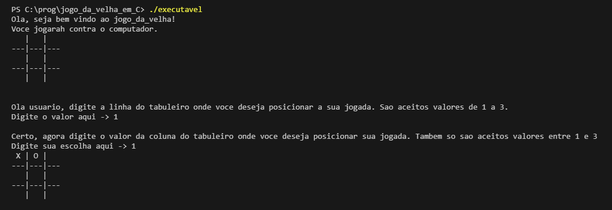

# Implementação de um programa de "jogo da velha" básico em linguagem C.

## Execute em sua máquina:

### Para executar esse programa em sua máquina é bem simples, basta clonar ou baixar o arquivo executável em sua maquina e iniciá-lo. O código já está compilado.

## Funcionamento:
### A lógica por trás deste programa é bem simples. Ele é composto por funções que são encarregadas desde a iniciação do tabuleiro do jogo que nada mais é do que uma matriz de dimensões 3x3, até a verificação de vencedor ou não. Para o usuário jogar, é pedido para que ele informe as dimensões de sua jogada, ou seja, é pedido a linha e a coluna da jogada(Ambas variam os valores entre 1 a 3), se forem informados valores inválidos, é pedido que o usuário digite novamente até que seja informado um valor válido.
### O computador joga de forma bastante simples, ele percorre a matriz tentando achar um espaço vazio e insere o caractere "O" no primeiro espaço vazio que encontrar. Se não encontrar, é declarado que o jogo terminou empatado e a execução do programa acaba.
### Fique a vontade para dar uma olhada nas funções e sugerir mudanças ou relatar erros na issue deste repositório.

## Ilustração de execução:

Neste exemplo o usuário decidiu por jogar na primeira posição do tabuleiro e o computador jogou na primeira posição vazia que encontrou.

## Minhas redes:

 

Vlw ✌✌✌✌✌

